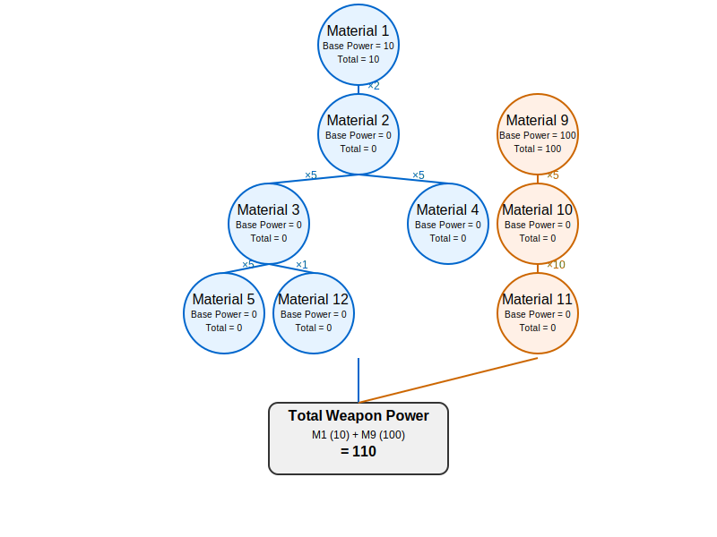

The following is the solution for the Quests outlined in README-QA. 

I installed PostgreSQL and started it and connected to it. On doing it, I created the databse weapon_quest_db and verified the connection.

`psql postgres //Connect to PostgreSQL`

`CREATE DATABASE weapon_quest_db; //Inside psql, create new database` 

`\l //Verify database creation`

`\c weapon_quest_db //Connect to the new database`

`\conninfo //Verify you're connected`

Having connected to and verified the database, I created the .env file with the parameters as suggested in the ENV_TEMPLATE. I then modified the package.json file and added the following scripts,

`"test": "jest --detectOpenHandles --forceExit --watch"`
`"test:coverage": "jest --coverage"`

And the following devdependencies,

`"devDependencies": {`
`    "jest": "^29.7.0",`
`    "supertest": "^7.0.0"`
`  }`

Once done, I ran the following commands. I then installed Insomnia and used the weapon_quests_insomnia_collection.json file to start testing the API. During the course of this, I found a couple of mistakes, such as the missing power_level/base_power in material database, which I then added to the table, the routes for composition not matching in server.js to name a few. 

`npm install`

`npm run migrate`

`npm run seed`

`npm start`

Then I started by creating a test_cases folder which had the following structure,

| test_cases | Where all the test cases reside |
|---|---|
| api_test | tests for various API end points apart from Materials |
|  |- composition_api_test.test.js | Testing composition API Endpoints |
|  |- weapon_api_test.test.js | Testing weapons API Endpoints |
|  |- misc_api_test.test.js | Miscellaneous API Endpoints |
| materials | test cases for each and every materials API Endpoints |
|  |- get_materials.test.js | GET API tested with test cases |
|  |- get_materials_by_id.test.js | GET API tested with test cases |
|  |- put_materials_by_id.test.js | PUT API tested with test cases |
|  |- delete_materials_by_id.test.js | DELETE API tested with test cases |
| weapon | tests for the API point from Weapon |
|  |- get_weapon_max_build_quantity.test.js | GET API for max build quantity test |
| e2e_test | Test for the End to End procedure for Weapon Creation |
|  |- weapon_creation_power.test.js | Weapon Creation and Power Calculation |

Apart from the above, the following service, called powerCalculationService.js was added for the calculation of power. 

`powerCalculationService.js`

Having completed the above, I started by creating and testing the test_cases for the APIs. For the APIs I tested using jest, by creating mock functions, creating local test materials, test sub materials, test weapons and checking if their relation does work. They can be run as follows,

`npm test test_cases/materials/get_materials.test.js`

`npm test test_cases/materials/get_materials_by_id.test.js`

`npm test test_cases/materials/put_materials_by_id.test.js`

`npm test test_cases/materials/delete_material_by_id.test.js`

`npm test test_cases/weapon/get_weapon_max_build_quantity.test.js`

I then created API Tests for the rest of the Endpoints. These involved testing the API's the same way as previously, but less exhaustively and testing only the basic functionalities. They can be run as follows,

`npm test test_cases/api_tests/composition_api_test.test.js`
`npm test test_cases/api_tests/weapon_api_test.test.js`

Lastly, I worked on the creation of end to end test for the creation of QA Stick and calculation of the power of the weapon. The test involves the following steps, 

#### Test 1 - Verifies Materials
- Checks material existence
- Documents material properties
- Shows hierarchical structure

#### Test 2 - Tests MaxBuildQuantity

- Verifies calculation
- Documents behavior with quantity changes
- Shows consistent value.

#### Test 3 - Calculates Weapon Power

- Shows step-by-step power calculations
- Documents material contributions
- Provides visual hierarchy
- Includes detailed logging

The test can be run as follows,
`npm test test_cases/e2e_test/weapon_creation_power.test.js`

A better understanding to the solution after finding an error, 
# Weapon System Documentation

## Power Calculation
Below is the visualization of how weapon power is calculated through the material hierarchy:

Currently:
- Material 1 has base power of 10
- Material 9 has base power of 100
- All other materials have power level 0 (null)
- Total weapon power = 110 (10 + 100)

## MaxBuildQuantity Calculation

### Material Requirements
To make ONE Material 2 we need:
- 5 Material 3
  └─ Each Material 3 needs:
     ├─ 5 Material 5 (25 Material 5 total for one Material 2)
     └─ 1 Material 12 (5 Material 12 total for one Material 2)
- 5 Material 4

### Available Quantities
- Material 2: 1 unit (existing)
- Material 3: 120 units
- Material 4: 70 units
- Material 5: 30 units
- Material 12: 120 units

### Calculation Steps

1. Limited by Material 3 (qty: 120):
   - One Material 2 needs 5 Material 3
   - Can make: 120/5 = 24 Material 2s

2. Limited by Material 4 (qty: 70):
   - One Material 2 needs 5 Material 4
   - Can make: 70/5 = 14 Material 2s

3. Limited by Material 5 (qty: 30):
   - One Material 2 needs 25 Material 5
   - Can make: 30/25 = 1.2 Material 2s

4. Limited by Material 12 (qty: 120):
   - One Material 2 needs 5 Material 12
   - Can make: 120/5 = 24 Material 2s

### Conclusion
The limiting factor is Material 5, which only allows for creation of 1.2 Material 2s.
Adding this to the existing 1 Material 2, we have 2.2 Material 2s total.

Since each weapon needs 2 Material 2s, the final maxBuildQty = 1.1 weapons (rounded down to 1).